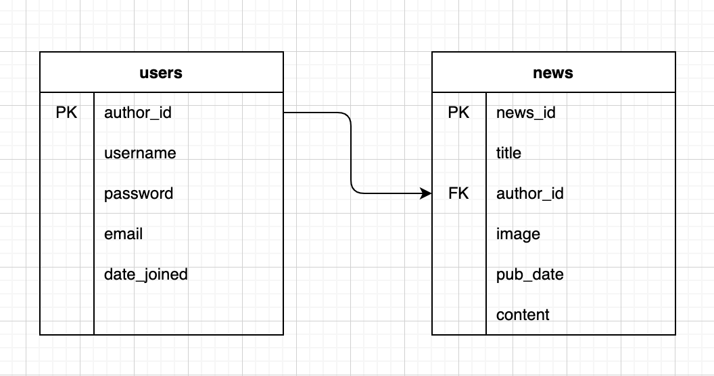
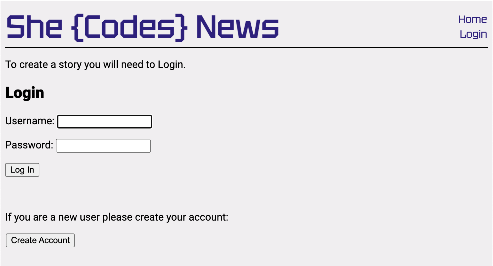
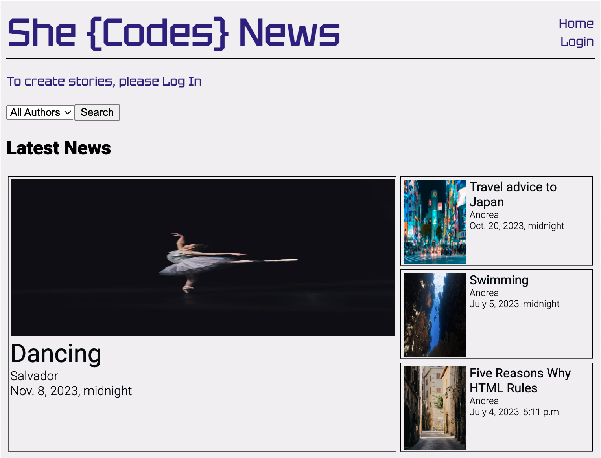
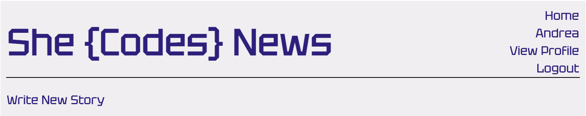
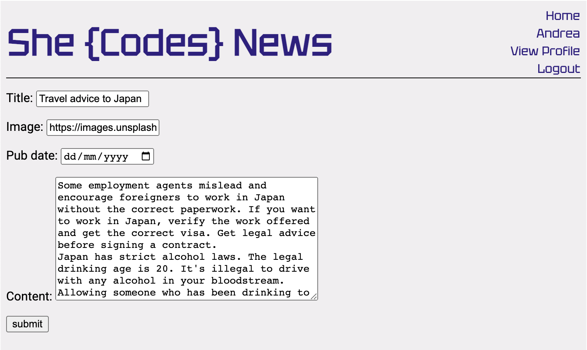
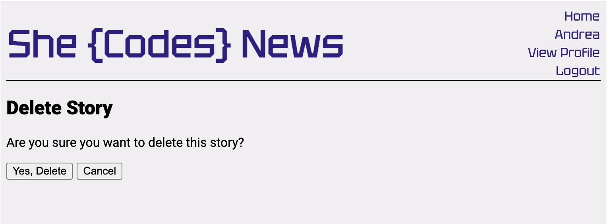

# Andrea Rivera- She Codes News Project

## About This Project
This project was done to practice python and Django concepts by building different features. This is a News Application where different users can post news. There is an authentication system (Create User, Log in and Log Out). A Profile View where users can see their information. The users can see other news created by other authors and can use a filter to see their post. The user can also update or delete news that they have created.

## How To Run This Code

1. Clone the repo to your local machine"
2. In the terminal, change directory into the repo you cloned using the command `cd news_project` .
3. Set up a virtual environment using the command `python -m venv venv`.
4. Activate the environment. if you use Windows with the command `venv/Scripts/activate`.  If you are in a Mac `source venv/bin/activate`
6. Open the folder in VS code.
7. Change directories so that you are in the same location as your manage.py file. Use the command `cd she_codes_news` 
8. Migrate the database using the command `python manage.py migrate`
9. Finally, run the server with the following command: `python manage.py runserver`

    
## Database Schema

    
## Project Features
- [x] Order stories by date

- [x] Styled "new story" form

- [x] Story images

- [x] Log-in/log-out

- [x] "Account view" page

- [x] "Create Account" page

- [x] "View stories by author" Users can use dropdown menu to view stories by a particular author

- [x] "Log-in" button only visible when no user is logged in

- "Log-out" button only visible when a user *is* logged in

- [x] "Create Story" functionality only available when user is logged in

## Additional Features:

- [x] Add the ability to update and delete stories (consider permissions - who should be allowed to update or and/or delete stories)

- Edit the story only for the same author of that story. The author must Log-In 

- Delete the story only for the same author of that story. There is a cancel button that will route to the home page

- [x] Gracefully handle the error where someone tries to create a new story when they are not logged in. I added a link "To create stories, please Log In" that will redirect the user to the login page

- Redirects the user to the login page